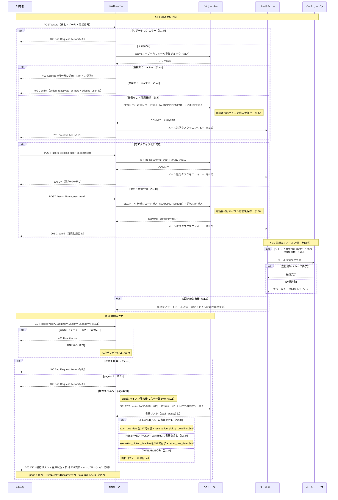

# シーケンス図

> 最終更新: 2026-05-29
> 生成ツール: SpecFlow（仕様駆動開発アシスタント）

---

## 設計上のポイント

1. **認証チェックをaltで切り出し** — §2.1の暫定認証要件（§7定義前）に基づき401チェックを最初の独立altに配置。認証済み以降のバリデーションと分離することでネスト深さを2段以内に制御。
2. **GET /booksエンドポイントをURIとして明記** — v1.4の完全性改善（CP2-001）に基づきエンドポイントパスをリクエスト行に含める。
3. **page < 1境界値エラーをalt分岐に追加** — v1.4補完の「page が1未満は400」を独立elseブランチで表現。
4. **inactiveフローのエンドポイントを更新** — v1.4補完の `POST /users/{existing_user_id}/reactivate` と `POST /users（force_new: true）`、409レスポンスの `action: reactivate_or_new` を反映。
5. **return_due_date/reservation_pickup_deadlineのnull返却を注釈で明示** — §2.3「該当しない状態ではnullを返す」を各書籍状態のnote内で明示。

---

