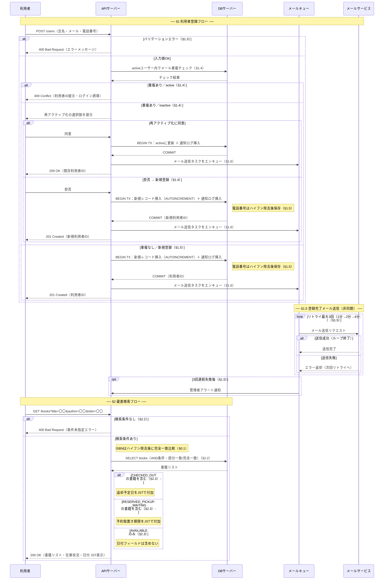

# シーケンス図

> 最終更新: 2026-05-29
> 生成ツール: SpecFlow（仕様駆動開発アシスタント）

---

## 設計上のポイント

1. **非同期メール送信はキュー経由** — §1.6「トランザクション完了後に非同期で実行」に従い、`DBコミット → メールキューへエンキュー` の順序を図示。
2. **inactive重複フローの2分岐** — §1.4の再アクティブ化「同意/拒否」が異なる後続処理を持つため、ネストaltで表現。
3. **partial unique indexの可視化** — §1.6のDB制約をアプリ層の重複チェック + DBコミット時の安全網として図に表現。
4. **検索結果の在庫状況別出し分け** — §2.3の3状態（CHECKED_OUT / RESERVED_PICKUP_WAITING / AVAILABLE）ごとに返却日フィールドをaltで出し分け。
5. **loopの早期終了をaltで補完** — Mermaidのloop構文は早期脱出を表現できないため、alt（成功時ループ終了）で補足。

---

